# 說明

* 本練習係學習Java Servlet的使用，共包含下列五個部分：

  * 練習1：透過Servlet註解(urlPatterns)設置訪問路徑
  * 練習2：透過web.xml文件配置訪問路徑
  * 練習3：掌握HTTP GET方法之請求參數獲取、請求轉發、重定向及返回響應數據
  * 練習4：掌握HTTP POST方法之請求參數獲取、請求轉發、重定向及返回響應數據
  * 練習5：結合Servlet+Mybatis+Mysql搭建用戶登入及註冊功能
    * 本練習已內建兩組帳號密碼如下：
      * 帳號：testac01 密碼：password
      * 帳號：testac02 密碼：password
    * 註冊頁面透過正則表達式進行表單驗證，驗證成功方能提交註冊之帳密：
      * 帳戶名稱：6~12位單詞字元(去除輸入內容之前後空白字元)，且不可與資料庫既有資料重複
      * 密碼：6~12位任意字元
* 各部分練習結果如圖：

  * 測試首頁：
    * 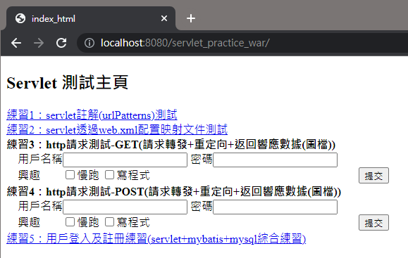
  * 練習1：
    * 前台畫面：
      * 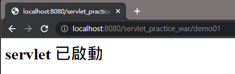
    * 後台畫面：
      * 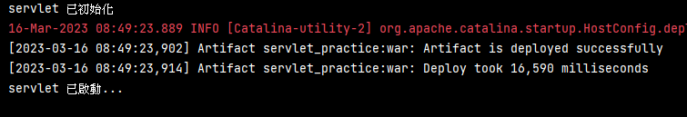
  * 練習2：
    * 前台畫面：
      * 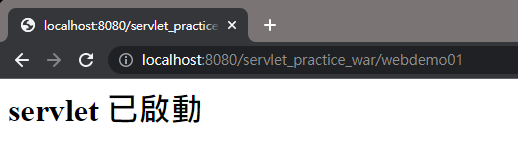
    * 後台畫面：
      * 
  * 練習3：
    * 前台畫面：
      * 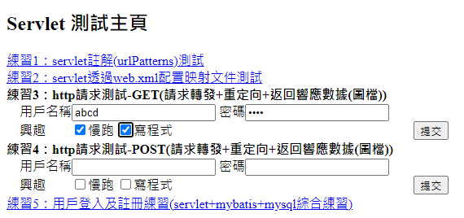
      * 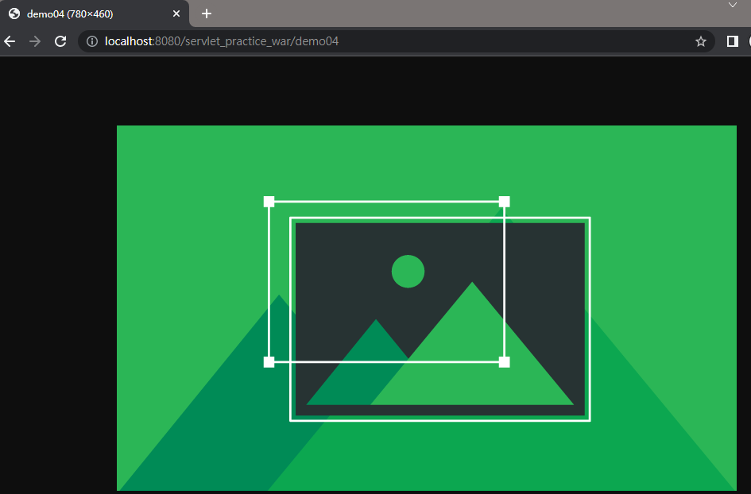
    * 後台畫面：
      * 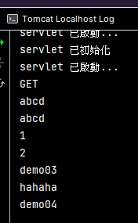
  * 練習4：
    * 前台畫面：
      * 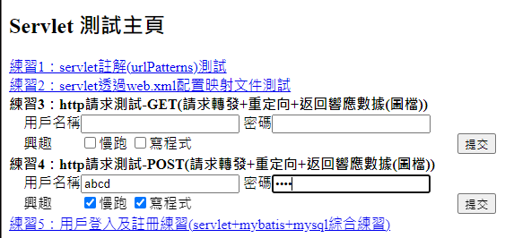
      * 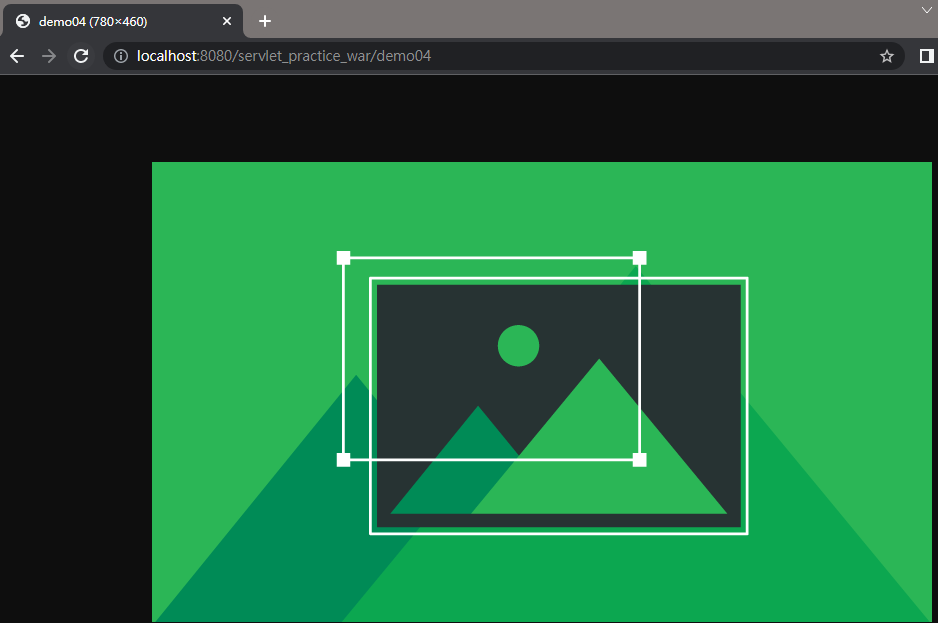
    * 後台畫面：
      * 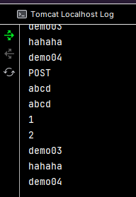
  * 練習5：
    * 前台畫面：
      * 登入
        * 登入頁面
          * 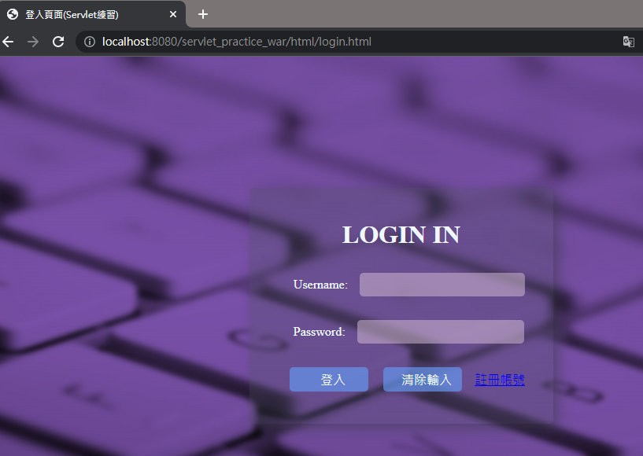
        * 登入成功(使用內建帳密)
          * 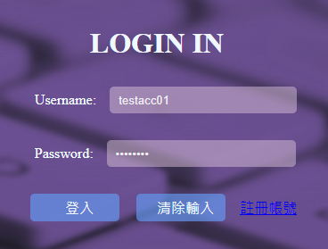
          * 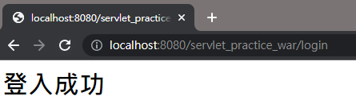
        * 登入成功(使用新註冊帳密)
          * 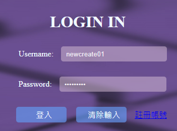
          * 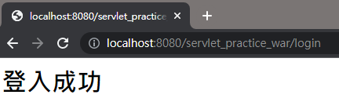
        * 登入失敗
          * 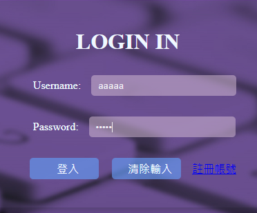
          * 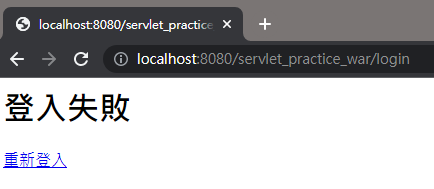
      * 註冊
        * 註冊頁面(前端)
          * 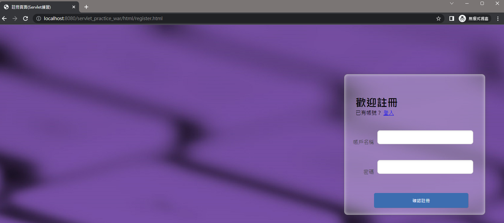
        * 註冊成功
          * 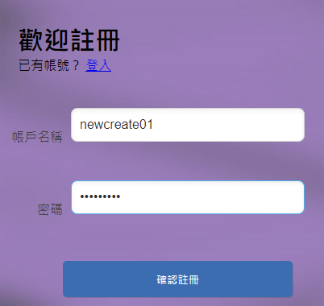
          * 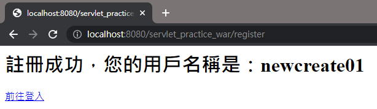
        * 註冊失敗
          * 不符合帳密規則無法提交表單
            * 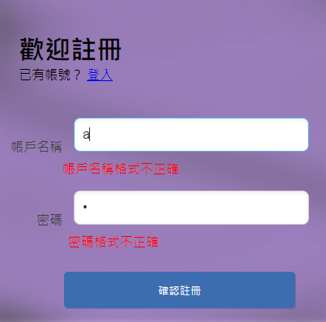
          * 帳戶名稱與資料庫既有資料重複，無法註冊
            * 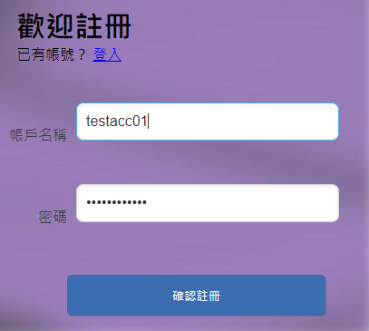
            * 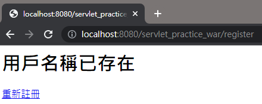
    * 後台(數據庫)畫面：
      * 註冊前(內建兩組帳號)
        * 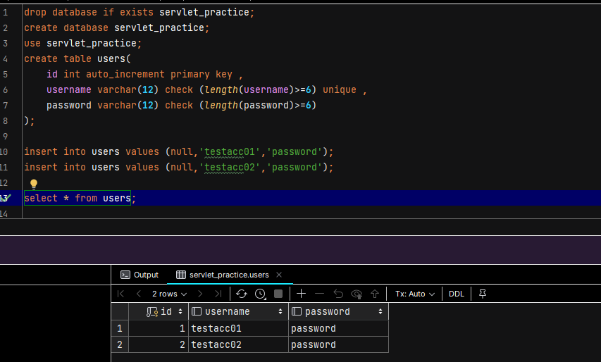
      * 註冊後
        * 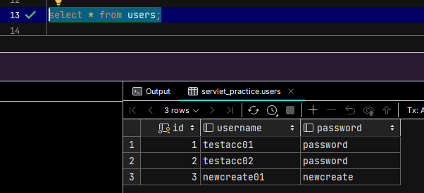
